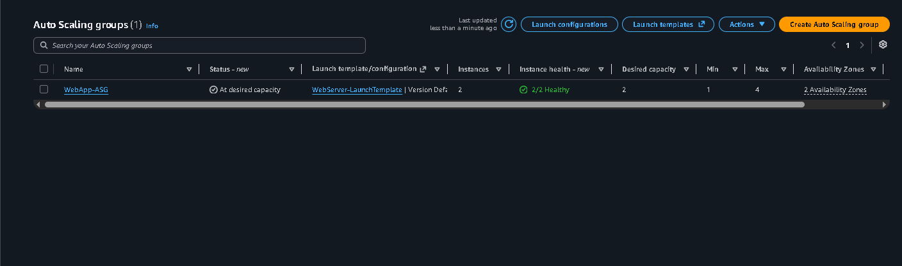
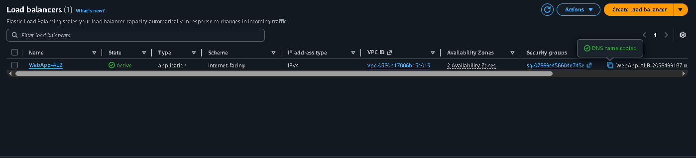

# AWS Auto Scaling & Load Balancing Lab 🚀

**Week 4 · Day 4 | AWS Cloud Accelerator Portfolio Project**

## 📋 Overview

This project demonstrates a **highly available, scalable AWS infrastructure** with auto-scaling and load balancing. The setup distributes traffic across multiple EC2 instances deployed across 2 Availability Zones (AZs) using an Application Load Balancer (ALB).

### Key Components
- **Launch Template**: Pre-configured EC2 instance blueprint
- **Auto Scaling Group (ASG)**: Automatically manages instance count based on CPU load
- **Application Load Balancer (ALB)**: Distributes incoming traffic across healthy instances
- **Target Group**: Routes traffic to backend instances with health checks

---

## 🎯 Lab Objectives - Completed ✅

- ✅ Create a Launch Template with Amazon Linux 2
- ✅ Deploy an Application Load Balancer across 2 AZs
- ✅ Configure an Auto Scaling Group with dynamic scaling policies
- ✅ Verify load balancing distribution across instances
- ✅ Document infrastructure with screenshots

---

## 📊 Architecture

```
Internet
   ↓
   ├─ ALB (WebApp-ALB) - Internet-facing
   ├─ Port 80 HTTP
   ├─ 2 Availability Zones
   ├─ Health Checks: /
   │
   ├─ AZ-A: EC2 Instance 1
   │  └─ ip-10-0-1-79.ec2.internal
   │
   └─ AZ-B: EC2 Instance 2
      └─ ip-10-0-2-180.ec2.internal

Auto Scaling Policy:
   Target Tracking (CPU: 50%)
   Min: 1 | Desired: 2 | Max: 4
```

---

## 🔧 Configuration Details

### Launch Template (WebServer-LaunchTemplate)
- **AMI**: Amazon Linux 2
- **Instance Type**: t2.micro
- **Key Pair**: web-server-key
- **Security Group**: SG-WebLab (HTTP 80 open)
- **User Data Script**: Installs Apache HTTP Server, displays instance hostname

### Application Load Balancer (WebApp-ALB)
- **Scheme**: Internet-facing
- **VPC**: OluTech-Production-VPC
- **Subnets**: Both public subnets (AZ-A & AZ-B)
- **Listener**: HTTP on port 80
- **Target Group**: WebServers-TG (Instances, HTTP/80)
- **Health Check**: Path `/` | Status Code: 200

### Auto Scaling Group (WebApp-ASG)
- **Desired Capacity**: 2
- **Minimum Instances**: 1
- **Maximum Instances**: 4
- **Scaling Policy**: Target Tracking
  - **Metric**: Average CPU Utilization
  - **Target**: 50%
- **Health Check Type**: ELB (Elastic Load Balancing)

---

## 📸 Verification Screenshots

### 1. Auto Scaling Group Status

- Status: At desired capacity
- Instances: 2/2 Healthy
- Availability Zones: 2 AZs

### 2. Application Load Balancer Active

- State: Active ✅
- Type: Application
- Scheme: Internet-facing
- VPC: 2 Availability Zones

### 3. Activity History

- Successfully launched 2 EC2 instances
- Timestamp: 2026-06-03
- Status: Successful

### 4. Load Balancing in Action - Instance 1

- **Hostname**: ip-10-0-1-79.ec2.internal
- **AZ**: us-east-1a

### 5. Load Balancing in Action - Instance 2

- **Hostname**: ip-10-0-2-180.ec2.internal
- **AZ**: us-east-1b
- **✅ Different hostname confirms load balancing is working!**

### 6. Round-Robin Distribution Confirmed

- Request routed back to Instance 1

### 7. Continued Distribution

- Request routed back to Instance 2

---

## 🧪 Testing & Results

### Load Balancing Test
✅ **Refreshed ALB DNS name 5-10 times**
- Each refresh displayed different instance hostname
- Confirmed round-robin traffic distribution
- Both instances in different AZs received traffic

### Health Check Verification
✅ **All instances passed health checks**
- Status: 2/2 Healthy
- Health check endpoint: `/`
- HTTP 200 responses received

---

## 🎓 Key Learnings

1. **High Availability**: Spreading instances across 2 AZs protects against single-zone failures
2. **Load Balancing**: ALB automatically distributes traffic for optimal performance
3. **Auto Scaling**: ASG automatically adjusts capacity based on demand (CPU threshold)
4. **Infrastructure as Code**: Launch Templates enable rapid, consistent deployments
5. **Health Checks**: Critical for removing unhealthy instances from rotation
6. **Monitoring**: Activity logs and instance health visibility are essential

---

## 📝 Lab Steps Summary

| Step | Component | Status |
|------|-----------|--------|
| 1 | Create Launch Template | ✅ Complete |
| 2 | Deploy Application Load Balancer | ✅ Complete |
| 3 | Configure Auto Scaling Group | ✅ Complete |
| 4 | Test Load Balancing | ✅ Complete |
| 5 | Clean Up Resources | ✅ Complete |

---

## 💰 Cost Optimization

**Important**: ALBs incur hourly charges (~$0.008/hr in us-east-1)

✅ **Cleanup Performed**:
- Deleted Auto Scaling Group (terminates instances)
- Deleted Load Balancer
- Deleted Target Group

---

## 🚀 Portfolio Impact

This lab demonstrates:
- AWS infrastructure design for scalability & availability
- Understanding of load balancing and traffic distribution
- Auto-scaling policies and capacity management
- Multi-AZ deployment best practices
- Infrastructure troubleshooting and verification

**Perfect for DevOps/Cloud Engineering portfolios!**

---

## 📚 Technologies Used

- **AWS Services**: EC2, Auto Scaling, Elastic Load Balancing (ALB)
- **Infrastructure**: VPC, Subnets, Security Groups, Launch Templates
- **Monitoring**: CloudWatch, AWS Console Activity Logs
- **OS**: Amazon Linux 2

---

## 👤 Author

**Greatbabz**  
AWS Cloud Accelerator | Portfolio Lab  
Date: 2026-06-03

---

## 📖 References

- [AWS Auto Scaling Documentation](https://docs.aws.amazon.com/autoscaling/)
- [Application Load Balancer Documentation](https://docs.aws.amazon.com/elasticloadbalancing/latest/application/)
- [EC2 Launch Templates Documentation](https://docs.aws.amazon.com/AWSEC2/latest/UserGuide/ec2-launch-templates.html)
