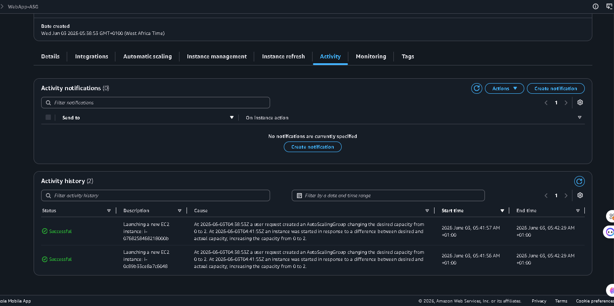

# ASG Screenshots

## 01-asg-healthy-instances.png
Auto Scaling Group dashboard showing:
- Name: WebApp-ASG
- Status: At desired capacity
- Instances: 2/2 Healthy ✅
- Desired: 2
- Minimum: 1
- Maximum: 4
- Launch Template: WebServer-LaunchTemplate
- Availability Zones: 2 AZs

## 02-asg-activity-history.png
ASG Activity tab showing:
- Instance launch events
- Successfully launched 2 EC2 instances
- Date: Wednesday, June 03 2026
- Status: ✅ Successful
- Cause: User request
- Timestamps of each launch

