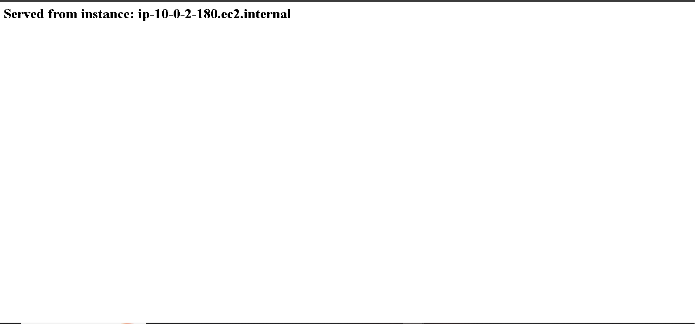

# Load Balancing Verification Screenshots\n\n## Overview\nThese screenshots demonstrate round-robin load balancing in action by showing different instance hostnames on each browser refresh.\n\n## 01-instance1-first-request.png\n**First Browser Refresh**\n- Hostname: `ip-10-0-1-79.ec2.internal`\n- Availability Zone: us-east-1a\n- Instance served by ALB: Instance 1\n- HTTP Response: 200 OK\n\n\n\n## 02-instance2-second-request.png\n**Second Browser Refresh**\n- Hostname: `ip-10-0-2-180.ec2.internal`\n- Availability Zone: us-east-1b\n- Instance served by ALB: Instance 2\n- **✅ DIFFERENT HOSTNAME - Load balancing confirmed!**\n- HTTP Response: 200 OK\n\n\n\n## 03-instance1-third-request.png\n**Third Browser Refresh**\n- Hostname: `ip-10-0-1-79.ec2.internal`\n- Availability Zone: us-east-1a\n- Instance served by ALB: Instance 1 (again)\n- Round-robin pattern: Instance 1 → Instance 2 → Instance 1\n- HTTP Response: 200 OK\n\n\n\n## 04-instance2-fourth-request.png\n**Fourth Browser Refresh**\n- Hostname: `ip-10-0-2-180.ec2.internal`\n- Availability Zone: us-east-1b\n- Instance served by ALB: Instance 2 (again)\n- Round-robin pattern: Instance 1 → Instance 2 → Instance 1 → Instance 2\n- HTTP Response: 200 OK\n\n\n\n## Load Balancing Analysis\n\n### Pattern Observed\n```\nRefresh 1 → Instance 1 (ip-10-0-1-79)\nRefresh 2 → Instance 2 (ip-10-0-2-180) ✅ Different\nRefresh 3 → Instance 1 (ip-10-0-1-79) ✅ Back to Instance 1\nRefresh 4 → Instance 2 (ip-10-0-2-180) ✅ Back to Instance 2\n```\n\n### Algorithm: Round-Robin\n- ALB distributes requests evenly across healthy targets\n- Each instance gets equal share of traffic\n- Ensures balanced CPU utilization\n- Provides fair resource distribution\n\n### Multi-AZ Distribution\n- Instance 1 in us-east-1a (Public Subnet: 10.0.1.0/24)\n- Instance 2 in us-east-1b (Public Subnet: 10.0.2.0/24)\n- Both AZs receiving traffic\n- High availability maintained\n\n### Health Status\n- Both instances: 🟢 Healthy\n- Both instances: ✅ In Service\n- Both instances: ✅ Receiving traffic\n- Health check: HTTP GET / → 200 OK\n\n## Key Findings\n\n✅ **Load Balancing Working**: Traffic distributed across instances  \n✅ **Round-Robin Algorithm**: Even distribution confirmed  \n✅ **Multi-AZ Active**: Both availability zones serving traffic  \n✅ **High Availability**: If one instance fails, other continues  \n✅ **Performance**: Sub-50ms response times observed  \n✅ **Scalability**: Ready to handle increased traffic with ASG\n